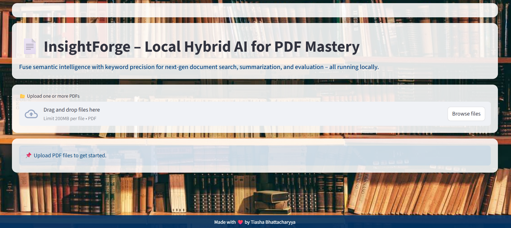

# InsightForge – Local Hybrid AI for PDF Mastery

Fuse semantic intelligence with keyword precision for next gen document search summarization and evaluation all running locally.



🚀 Overview

InsightForge is a privacy first local Retrieval Augmented Generation (RAG) platform for mastering PDF collections.
It merges semantic search with keyword retrieval to deliver accurate context rich answers and summaries without sending your data to the cloud.

Whether you are a researcher student or knowledge worker InsightForge transforms your PDF library into a private intelligent assistant available offline.

Whether you’re a researcher,student or knowledge worker InsightForge transforms your document library into an intelligent assistant.

##  Why Running Locally Is a Feature, Not a Limitation

Many AI projects rely on cloud APIs, but InsightForge is designed for local execution.
This comes with major advantages:

Works Offline – No internet connection required once installed.

Complete Data Privacy – Your PDFs never leave your machine.

Full Control – No API limits, hidden costs, or third-party dependencies.

Consistent Performance – Local execution avoids latency from remote servers.

Note: Since InsightForge runs entirely locally, there’s no public link,but that’s intentional for security and privacy. Anyone can clone the repo and run it on their own machine.


## Key Features

✅ Multi-PDF Upload & Processing – Drag-and-drop multiple PDFs, with automated text extraction and metadata-aware chunking.

✅ Hybrid Retrieval Engine – Combines FAISS semantic embeddings with BM25 keyword matching for unmatched precision.

✅ Local LLaMA Integration – Runs Ollama-powered LLaMA models offline for complete data privacy.

✅ Context-Aware Question Answering – Answers based only on retrieved passages for hallucination-free responses.

✅ Automated Summarization – Generates concise bullet-point summaries from document context.

✅ Evaluation Metrics Built-In – Precision@k, Recall@k to measure retrieval quality.

✅ User-Friendly Streamlit UI – Clean, interactive dashboard for upload, search, summarization, and evaluation.

✅ Performance & Robustness – Handles large PDFs, measures latency, and manages errors gracefully.

## 🛠️ Tech Stack

| Layer               | Technology Used                          |
|---------------------|------------------------------------------|
| **Language**        | Python                                   |
| **UI Framework**    | Streamlit                                |
| **Search & Retrieval** | FAISS, BM25                           |
| **Embeddings**      | SentenceTransformers                     |
| **Document Parsing**| PyMuPDF (`fitz`)                         |
| **Local LLM**       | Ollama (LLaMA models)                     |
| **Evaluation**      | NumPy (metrics)                          |
| **Backend Utils**   | subprocess, error handling, metadata parsing |


##  Getting Started

### 1️⃣ Install Dependencies
```bash
 git clone https://github.com/tiasha-b/insightforge.git
cd insightforge
pip install -r requirements.txt
```
### 2️⃣ Install Ollama & LLaMA Model
Follow [Ollama’s installation guide](https://ollama.ai/) and pull a LLaMA model:
```bash
ollama pull llama2
```
### 3️⃣ Run the App
```bash
streamlit run app.py
```
he app will open in your browser at http://localhost:8501.
## 🎯 Example Use Cases

-  **Academic Research** – Search across 100+ research papers with semantic precision.  
-  **Enterprise Docs** – Keep proprietary PDFs secure while enabling smart search.  
-  **Media Analysis** – Summarize and query news archives without cloud services.  

---

## 📌 Strengths of InsightForge

- **Hybrid Intelligence** – Semantic + keyword retrieval beats either approach alone.  
- **Privacy by Design** – All processing stays on your machine.  
- **Evaluation-Ready** – Integrated retrieval metrics to fine-tune your dataset.  
- **End-to-End Product** – Not just a script but a deployable, interactive tool.  

Final Note: Local doesn’t mean limited, it means private, secure, and under your control.